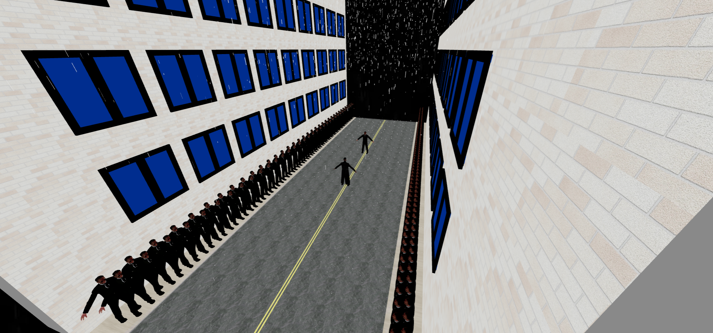

# Matrix Revolutions 3js Fight Scene



This repository contains a dynamic 3D fight scene inspired by the iconic Matrix Revolutions movie, built using the Three.js library. Immerse yourself in the Matrix as you experience an intense battle between characters in a visually stunning environment.

## Table of Contents

- [Demo](#demo)
- [Features](#features)
- [Installation](#installation)
- [Usage](#usage)
- [Controls](#controls)
- [Contributing](#contributing)
- [License](#license)

## Demo

Check out the live demo of the Matrix Revolutions 3js Fight Scene [here](https://your-demo-link.com).

## Features

- Realistic 3D models and textures.
- Dynamic camera angles for an immersive experience.
- Interactive controls to engage with the fight scene.
- Physics-based animations for natural character movements.
- Atmospheric lighting and effects.

## Installation

To run the Matrix Revolutions 3js Fight Scene locally, follow these steps:

1. Clone the repository:

   ```bash
   git clone https://github.com/your-username/matrix-revolutions-3js.git
